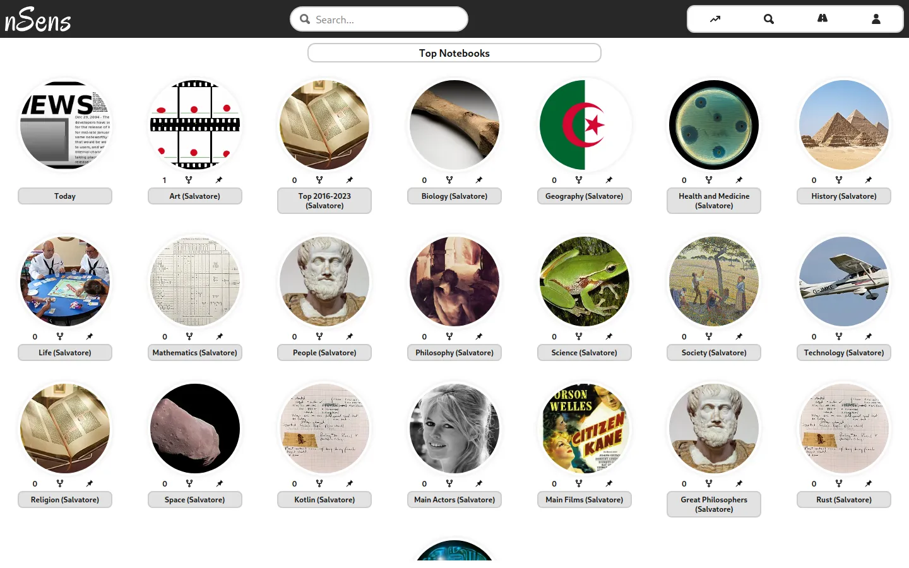
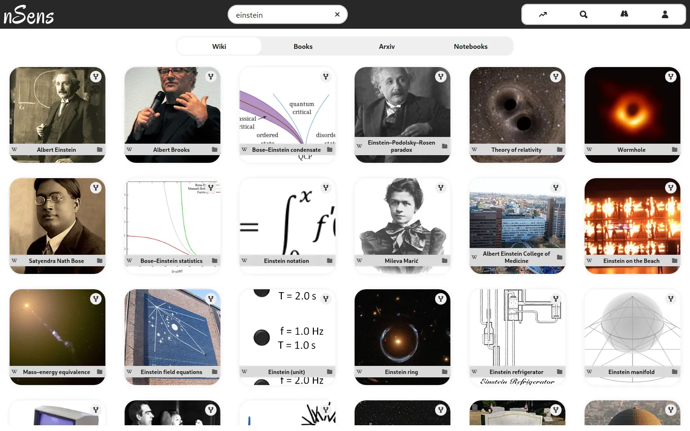
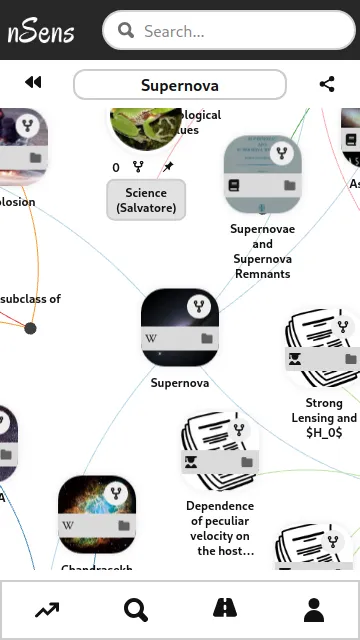

[README.md](https://github.com/user-attachments/files/25815985/README.md)
# nsens-frontend

The interactive web application for **nsens**, a platform designed to explore and organize knowledge through immersive graphs and articles.

## 🚀 Overview

Built with **Next.js** and **TypeScript**, the nsens frontend delivers a highly responsive and visual experience. It allows users to navigate the "Scientific Universe" by pulling data from Wikipedia and ArXiv, representing concepts as interactive 2D and 3D force-directed graphs.

## ✨ Key Features

- **Knowledge Atoms as Cards**: The primary way to discover knowledge is by navigating through "Atoms of Knowledge" presented as interactive cards.
- **Social Knowledge Networking**: nsens acts as a specialized social network where users curate their own learning paths by organizing these knowledge cards into personalized **Knowbooks**.
- **Multi-View Visualizations**: Explore your knowledge from different perspectives. Switch seamlessly between:
    - **List View**: For quick scanning and organization.
    - **Article Mode**: For deep reading and contextual learning.
    - **Graph View**: For visualizing complex connections using **2D/3D Force-Directed Graphs** (D3 & Three.js).
- **Wikipedia & ArXiv Integration**: Seamlessly browse and "atomize" knowledge from major scientific and encyclopedic sources.
- **Multilingual UI**: Fully localized in English, French, and Italian.
- **PWA Ready**: Progressive Web App support for a native-like experience on both mobile and desktop.
- **State Management**: Reactive and robust state handling powered by **MobX**.
- **Responsive Design**: Optimized for all screen sizes using Pinterest's **Gestalt** design system.

## 📸 Screenshots

| Home (Desktop) | Search (Desktop) | Network (Mobile) |
| :---: | :---: | :---: |
|  |  |  |

## 🛠 Tech Stack

- **Framework**: [Next.js](https://nextjs.org/) (React)
- **State Management**: [MobX](https://mobx.js.org/) & [MobX-React-Lite](https://mobx.js.org/react-integration.html)
- **Visualizations**: [react-force-graph](https://github.com/vasturiano/react-force-graph) (D3.js & Three.js)
- **UI Components**: [Gestalt](https://gestalt.pinterest.systems/) (Pinterest Design System)
- **Data Fetching**: [Axios](https://axios-http.com/)
- **SEO & Performance**: [next-sitemap](https://github.com/iamvishnusankar/next-sitemap) for automated SEO.

## 📥 Getting Started

### Prerequisites

- Node.js (v18+)
- A running instance of the [nsens-backend](../backend)

### Installation

1. Navigate to the frontend folder:
   ```bash
   cd frontend
   ```
2. Install dependencies:
   ```bash
   npm install
   ```

### Configuration

Create a `.env` file in the `frontend/` directory with your backend URL:

```env
NEXT_PUBLIC_BACK_URL = http://localhost:3001/nsens_v1
NEXT_PUBLIC_FRONT_URL = http://localhost:3000
```

### Running the Application

- **Development Mode**:
  ```bash
  npm run dev
  ```
- **Build for Production**:
  ```bash
  npm run build
  npm run start
  ```
- **Static Export**:
  ```bash
  npm run export
  ```

## 🏗 Structure

- `src/components`: UI components built with Gestalt and custom React logic.
- `src/stores`: MobX stores for global state management (Graph, Knowbook, UI).
- `src/handlers`: Logic for API interactions.
- `src/libs`: Utility functions and complex graph physics configurations.
- `pages/`: Next.js file-based routing with support for multilingual subdirectories.

---
*nsens was developed as a personal project to bridge the gap between vast data sources and personal knowledge organization.*
